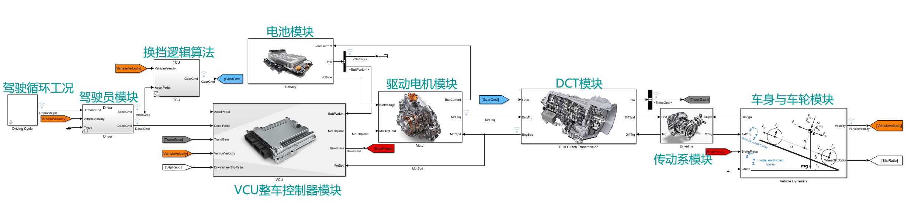
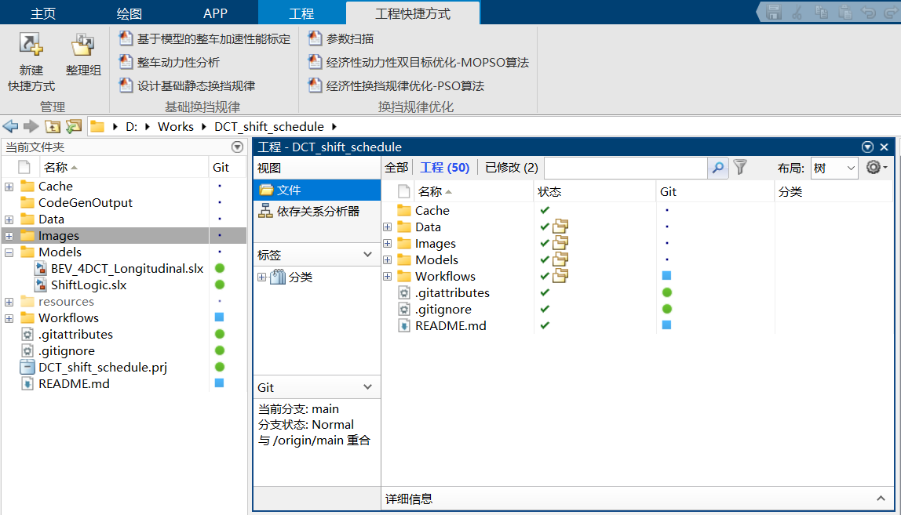

# 纯电动商用车4速DCT换挡规律设计

换挡规律，又称换挡策略、挡位决策，是指在给定的动力部件参数基础上，根据驾驶员的行驶意图、车辆运行状态和车辆行驶的外部环境选择换挡时机的问题。其设计结果将直接或间接影响车辆的经济性、动力性以及驾驶舒适性，并在一定程度上影响变速箱寿命。

本项目以一辆搭载了 4 速 DCT 变速器的 11 座纯电动商用车为研究对象，在 Simulink 中搭建简易纵向动力学模型、以经济性/动力性两个目标设计双参数静态换挡规律，并通过多目标粒子群优化算法对换挡规律进行优化。

## 运行项目

需要在 MATLAB 2023b 及以上版本中运行。首先点击根目录下的 [DCT_shift_schedule.prj](./DCT_shift_schedule.prj)，启动工程，由工程自动完成工作区目录加载、变量加载、模型初始化等工作。

包含多个子项目，入口脚本已全部在“工程快捷方式”中列出，选中工程选项卡后，可直接通过工具栏运行。

1. [基于汽车行驶方程式的简单静态分析计算](./Workflows/static_analysis.m)
2. [基于静态分析计算结果设计经济性动力性换挡规律](./Workflows/static_shift_lines.m)
3. [基于模型的固定加速踏板开度固定挡位加速性能分析](./Workflows/calibrate.m)
4. [基于 Ramp-Offset 的参数扫描](./Workflows/shift_schedule_optimization/parameter_sweep.m)
5. [基于 PSO 算法的经济性换挡规律优化](./Workflows/shift_schedule_optimization/optmize_economy_PSO.m)
6. [基于 MOPSO 算法的经济性动力性双目标换挡规律优化](./Workflows/shift_schedule_optimization/optmize_economy_dynamic_MOPSO.m)

此外，还有数个用于绘图的函数和脚本，可以按需调用。

## 项目结构

全部开发均在 MATLAB R2023b 中完成，不涉及联合仿真。主要目录结构如下：

- `Cache`: 缓存文件夹，存储 Simulink 模型缓存文件等。在出现错误时，可尝试删除此文件夹下的所有文件，再重新运行项目。
- `Data`: 数据文件夹，包含驾驶循环数据、电机数据、模型中使用的参数等，也包含相关的数据可视化绘图脚本。
- `Images`: 图片文件夹，保存文模、文档中用到的图片。
- `Models`: Simulink 模型文件，包含换挡状态机（控制器逻辑）、整车动力学仿真两个模型。
- `resources`: MATLAB 项目工程自动生成的文件，**勿手动修改或删除**。
- `Workflows`: 代码工作流文件夹。

## 注意事项

### 软硬件环境配置

由于将 Simulink 的仿真作为动力性/经济性评估函数的一部分，在进行粒子群优化时有极大量的仿真计算。使用个人电脑进行一次优化计算可能耗时数小时至十数小时。强烈建议：

1. 为 MATLAB 配置 [C/C++ 编译器](https://ww2.mathworks.cn/support/requirements/supported-compilers.html)，加快仿真运行速度。
2. 安装 [Parallel Computing Toolbox](https://ww2.mathworks.cn/products/parallel-computing.html)，使用并行仿真，在多核 CPU 上同时运行多个仿真，缩短总任务耗时。
3. 使用高主频、多核心的高性能 CPU。
4. 如果使用并行仿真，检查物理内存是否充足。经实测，对于14核心20线程的 Intel Core i5-13600KF，使用全部线程并行运行时，32GB 内存配置会因物理内存耗尽，使用硬盘交换空间反而极大拖慢运行速度，必须使用 **64GB** 内存配置才能满足运行需求。

## 模型与算法代码设计

### 变体子系统

使用 Simulink 中的变体子系统，在同一模型中实现灵活的多种模块切换。例如，通过变量 `CalibrateMode` 选择使用驾驶员模型/固定加速踏板开度；通过变量 `ConstantGearMode` 选择TCU自动换挡/固定挡位。见模型顶层的 Driver 模块与 TCU 模块。

### 以数据类形式结构化存储复杂数据

对于本项目的主要研究对象——换挡规律表，通过一个专门的*类* [ShiftSchedule](./Workflows/ShiftSchedule.m) 实现。一方面，具有结构体的优势：将一组紧密联系的数据以“名-值”的形式整体存储，直接查看原始数据内容时亦能保证清晰易读、不缺失条目；另一方面，通过*运算符重载*技巧，实现换挡规律表间的加减法运算、与数值间的乘除法运算等可能在粒子群算法中使用的运算方法，这样将“数据间的运算”这一与数据结构有紧密关系的逻辑也封装在内部，对外提供简单的接口，利于算法逻辑与数据结构的分离。

### 通过 MATLAB 控制 Simulink 仿真

利用 [Simulink.SimulationInput](https://ww2.mathworks.cn/help/simulink/slref/simulink.simulationinput.html)，对模型工作区进行临时修改，实现对仿真所使用的参数和配置的调整。对需要关注的模型信号添加记录，从 [Simulink.SimulationOutput](https://ww2.mathworks.cn/help/simulink/slref/simulink.simulationoutput.html) 中的 `logsout` 属性获取仿真过程这些信号值随时间变化情况。

使用*工厂模式*编程技巧，在 [`simin_factory`](./Workflows/Utilities/simin_factory.m) 等函数中对 `simIn` 的创建过程进行封装，隐去创建 `Simulink.SimulationInput` 对象、处理换挡参数表创建模型使用的查找表、使用驾驶员模型或固定踏板开度、驾驶循环选择、控制仿真时间……等一系列繁琐过程，对外部调用者提供简单的接口，只需传入换挡规律表对象、驾驶循环名称，即可快速创建一个对应的仿真输入目标。结合 MATLAB 善于处理数组和矩阵的风格，还允许以数组形式批量传入多个换挡规律表，批量创建仿真输入目标，便于使用并行仿真。

### 模型引用实现控制器逻辑与动力学模型解耦

在如今的汽车电子行业，基于模型的设计（Model-Based Design，MBD）是一种非常流行的控制器应用层软件开发方式。首先在 Simulink 或其他联合仿真软件中搭建被控对象的物理学模型（在本项目中，为整车纵向动力学模型）；然后在另一个独立的 Simulink 模型中搭建控制器逻辑（在本项目中，仅包含按换挡规律表进行挡位切换），并为之配置固定时间补偿+离散求解；通过模型引用或其他方式，将控制器逻辑模型与被控对象模型结合，通过仿真观察当前控制逻辑及参数的性能，进而进行优化调整，再通过代码生成等方式部署至 ECU 实物，进行台架测试等后续开发流程。有时，也可以将台架或测试车辆的传感器数据进行记录处理，以数据的方式构建被控对象模型，进行开发工作。

通过[模型引用](https://ww2.mathworks.cn/help/simulink/model-reference.html)技巧，至少可获得以下优势：

- 控制逻辑与物理学模型的分离，控制逻辑可配置用于 ECU 代码生成，以固定的离散时间间隔运行，而不影响仿真模型以可变步长连续运行；亦可实现同一控制逻辑在不同的被控对象模型上的运行；
- 约定接口后，大型项目可由多个开发者合作完成，每人负责有限个模块/模型的开发，相互独立；如果开启对并行编译的支持，则可明显提高大型工程的编译速度；
- 可用于加密，模型引用者只能运行加密后的被引用模型，而不可访问其内部实现；
